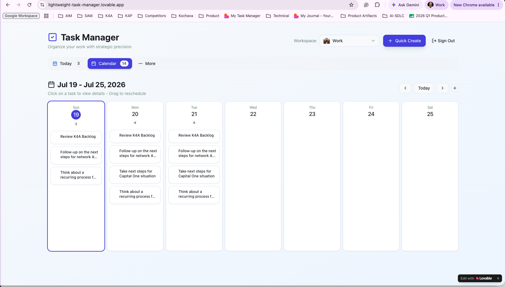
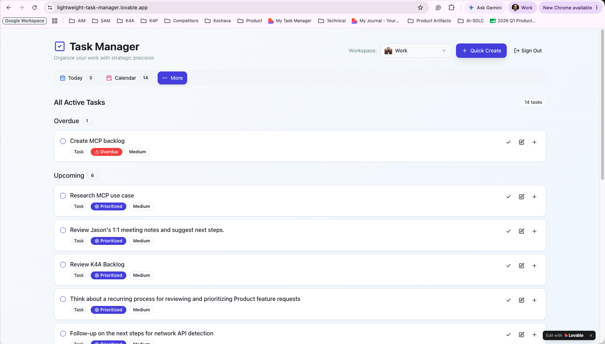
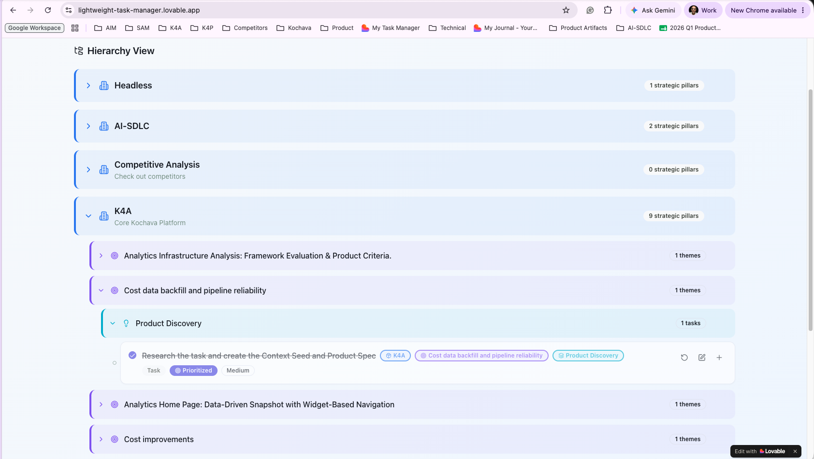
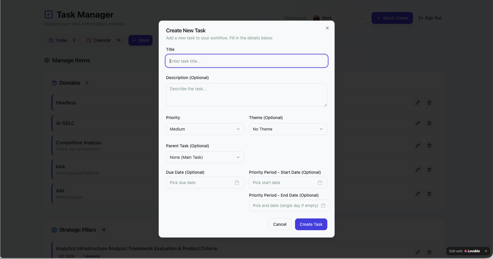

# priority-drive

**A strategic task management tool built by a PM, for PMs — designed to solve the "due date illusion" problem that breaks most task managers.**

> 📌 **Looking for the user manual?** See [README.md](README.md) for full feature documentation, setup instructions, and tech stack details.

---

## The Problem

Most task managers are built around **due dates** — the day a task needs to be *done*. But here's the disconnect:

**Setting a due date doesn't tell you when to START working on it.**

As a Product Manager, I found myself constantly behind on deadlines because:

1. **Due-date views hide work-in-progress** — A PRD due July 30 doesn't appear in my "Today" view on July 16, even though I need to start drafting it *two weeks early* to hit the deadline.
   
2. **Manual workarounds create clutter** — To fix this, I'd either:
   - Set an artificial "fake" due date 2 weeks early (loses the real deadline)
   - Duplicate the task across 14 days (manual sync nightmare when scope changes)
   - Add a "Start Date" field and filter by it (but then it only shows *once*, not across the entire work period)

3. **No tool separates "when to work on it" from "when it's due"** — The question *"What should I prioritize today to hit my deadlines?"* requires mentally calculating backwards from every due date. Cognitively exhausting.

**The core insight:** Due dates are *outcomes*. What I needed was a way to define the **priority period** — the span of days *before* the due date when a task should be front-of-mind.

---

## The Solution

priority-drive introduces a new primitive: **Priority Start + End Dates** (separate from due date).

### How it works

Instead of just setting a due date, you define:
- **Priority Start Date** — When you need to BEGIN working on this
- **Priority End Date** — When you need to FINISH working on this  
- **Due Date** (optional) — The external deadline, if different

**Example:**
- Task: "Draft Q3 Product Strategy"
- Due Date: July 30
- Priority Period: July 16 – July 29 (2 weeks before due date)

**Result:** The task appears in your "Today" view *every single day* from July 16–29, even though it's not "due" until July 30.

This solves the backward-planning problem: you set the priority window *once*, and the tool automatically surfaces the task every day during that window. No manual duplication, no fake due dates, no mental math.

---

## Key Design Decisions

### 1. Why separate "Priority Period" from "Due Date"?

**Decision:** Introduce Priority Start/End as first-class fields, independent of due date.

**Rationale:** Due dates answer *"When does this need to be done?"* Priority periods answer *"When do I need to work on this to hit the deadline?"* These are fundamentally different questions. Conflating them (like every other tool does) forces users to either:
- Ignore due dates and just use start dates (loses accountability)
- Ignore start dates and react to due dates (constant fire drills)

Separating them lets you plan proactively ("I'll work on the PRD for 2 weeks starting July 16") while still tracking the real deadline ("due July 30 for the board meeting").

**Trade-off:** Slightly more complex data model (3 date fields instead of 1), but eliminates an entire class of workarounds users currently hack together.

---

### 2. Why show priority tasks in "Today" view across the entire span?

**Decision:** If today falls within a task's priority period, show it in "Today" — even if it's not due today.

**Rationale:** The whole point of setting a priority period is to say "I should be thinking about this task from July 16–29." If it only appeared *once* on July 16, I'd forget about it. If it only appeared on July 30 (the due date), I'd be scrambling.

By appearing every day within the priority window, the task becomes a persistent reminder: *"You chose to work on this during this timeframe — make progress today."*

**Trade-off:** "Today" view can get crowded if too many tasks have overlapping priority periods. Mitigation: users learn to set realistic priority windows (you can't prioritize 10 things simultaneously for 2 weeks).

---

### 3. Why a 4-tier strategic hierarchy on top of this?

**Decision:** Enforce a Domain → Strategic Pillar → Theme → Task structure in addition to the priority-period mechanic.

**Rationale:** Priority periods solve *when* to work on something. The hierarchy solves *why* you're working on it. Without strategic roll-up, a task like "Draft Analytics PRD" is just an isolated to-do. With hierarchy, it maps to:
- Domain: K4A (Kochava for Advertisers)
- Strategic Pillar: Data Access
- Theme: Analytics Infrastructure
- Task: Draft Analytics PRD

This makes it impossible to have "orphan tasks" that don't ladder up to a goal. If I can't map a task to a pillar, that's a signal the task isn't strategic — maybe I should delete it.

**Trade-off:** Forces discipline (less flexibility), but prevents the "1,000 unorganized tasks" problem that plagues flat task managers.

---

### 4. Why build with Lovable (low-code) instead of React from scratch?

**Decision:** Use Lovable's AI-assisted development instead of writing a custom React app.

**Rationale:** As a PM, my comparative advantage is product design, not frontend engineering. Lovable let me iterate on the priority-period UX in *2 days* instead of spending weeks building a custom calendar component. I could validate the concept fast and dogfood it immediately.

**Trade-off:** Less control over code structure, but 10x faster iteration speed. For a solo side project testing a new interaction model, speed >> control.

---

## What I Learned

### 1. **The "due date illusion" is universal**
After using this for 4 months, I realized how broken the due-date-only model is. I asked 3 other PMs how they handle "start working on X two weeks before it's due" — all of them had manual hacks (fake due dates, calendar blocks, or just... forgetting and scrambling at the last minute). This validated the problem is real, not just a personal quirk.

### 2. **Priority periods reduce decision fatigue**
With due-date-only tools, every morning I'd ask: *"What should I work on today to hit my deadlines?"* That's an optimization problem I had to solve manually. With priority periods pre-set, "Today" view already shows me the answer. Cognitive load dropped noticeably.

### 3. **Strategic hierarchy prevents priority-period abuse**
Early on, I'd set 2-week priority periods for *everything*, which defeated the purpose (can't prioritize 15 things simultaneously). The strategic hierarchy forced me to ask: *"Does this task roll up to an active pillar?"* If not, I'd delete it instead of setting a priority period. The tool became an accountability mechanism for saying no.

### 4. **This would be a 1-line feature add for Asana/Todoist... but they haven't**
The feature is conceptually simple: add two date fields ("Priority Start" and "Priority End") and filter Today view by `priority_start <= today <= priority_end`. Yet no major tool does this. I suspect it's because they're optimized for *task completion* (due dates) rather than *work planning* (priority periods). PMs need the latter.

---

## Tech Stack

- **Frontend:** React + TypeScript  
- **Styling:** Tailwind CSS + shadcn-ui components  
- **Database & Auth:** Supabase (row-level security for data isolation)  
- **Build Tool:** Vite  
- **Drag & Drop:** @dnd-kit (for calendar rescheduling)  
- **Date Handling:** date-fns  

---

## Screenshots

### Calendar View (showing priority spans)

*Tasks with 2-week priority periods appear across multiple days in calendar view*

### Today View (filtered by priority period)

*"Today" view shows all tasks where today ∈ [priority_start, priority_end]*

### Hierarchy View (strategic roll-up)

*Every task maps to Domain → Pillar → Theme structure*

### Quick Create Menu

*Create tasks, themes, pillars, and domains on the fly*

---

## Live Demo

🔗 [Try it live](https://lighthearted-task-manager.lovable.app) *(requires sign-up — authentication via Supabase)*

---

## Reflection

This project taught me that **the best product ideas come from noticing what you're manually working around every single day**.

I didn't set out to "build a task manager." I set out to solve: *"Why do I keep missing deadlines even though I set due dates?"* The answer was that due dates don't tell you when to *start* — they only tell you when to *finish*. Once I named that problem, the solution (priority periods) became obvious.

If you're a PM who's ever felt like you're constantly behind despite diligently setting due dates, this is the tool I wish had existed.

---

## Usage Stats (Personal Dogfooding)

- **Active since:** March 2026 (4 months)
- **Tasks completed:** 177
- **Active domains:** 6 (Headlines, AI-SDLC, Competitive Analysis, K4A, AIM, MCP)
- **Avg priority period length:** 7 days
- **Deadline hit rate:** ~85% (vs. ~60% with Asana due-date-only workflow before this)

---

## About This Project

This is a working side project I built and actively use to manage my work as a Product Manager. It's not a code showcase — it's a product thinking showcase. The goal was to solve a real workflow problem, not demonstrate technical skills.

For the full feature list, setup instructions, and technical documentation, see [README.md](README.md).
